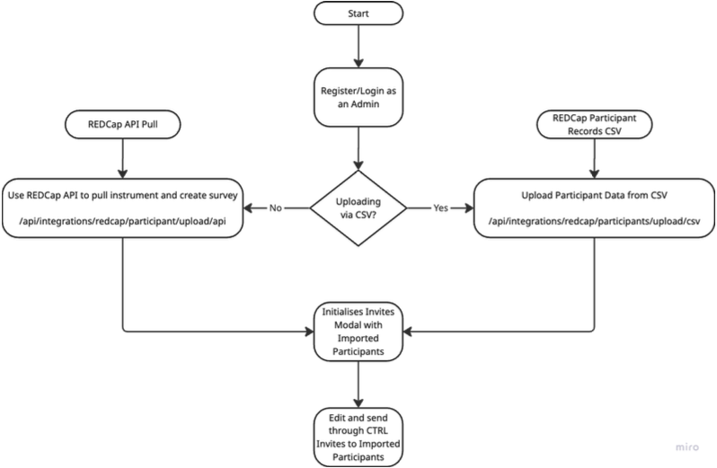

# CTRL Epic 02: Import Participant List from REDCap

## Related GUARDIANS Task

3D-4-1: Demonstrated implementation of integration with upstream provider of consent status (REDCap) and downstream consumer of consent status via successful integration tests; released on a platform like GitHub with documentation and an open-source license.

## User Story

As a study admin, I want to import participants from an instance of REDCap, so that I can manage recruitment directly in CTRL without re-entering data.

## Context

## Acceptance Criteria

- Import should happen in the context of an existing survey
- Admins can import participants via REDCap API or CSV
- Imported data should seamlessly integrate with CTRL invitation workflows
- Duplicate participant should be ignored (when already in CTRL)
- New participants records should be created in CTRL
- New participant emails should be displayed in the invite modal for review before sending invitations
