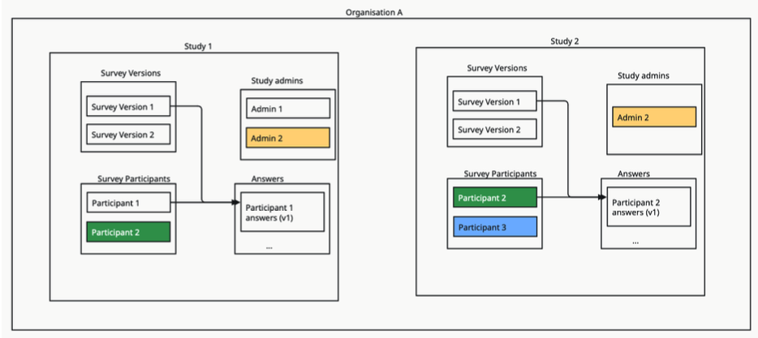

# CTRL Epic 03: Multiple Studies

## Related GUARDIANS Task

3D-5-1: Beta release deployment of CTRL service

## User Story

As a study admin, I want to create multiple studies within the same organisation, so that study and participants can be managed separately.
As a participant, I want to review the different studies I am participating to, so that I can give different consent to each study.

## Context

## Acceptance Criteria

- All API endpoints allow specification of a study where appropriate
- Participants can see which study they are curently viewing and switch to another study if available
- Participants can review the consent of the different study they are part of
- Participants can only view the studies they are part of
- Participant cannot access a study that have been archived
- Study admins can create a new study and edit details (name, description, logo)
- Study admins can switch between study and perform all tasks related to a specific study managment
- Study admins can invite participants from an existing study to a new study
- Access to each study is managed separately based on roles
- Integration apply per-study where appropriate
