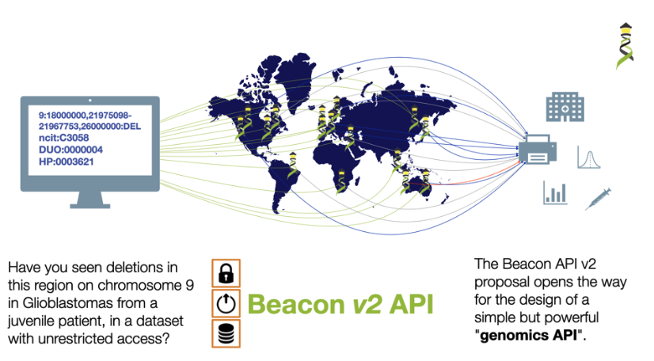

# RDDP Epic 01: Cohort-level beacon on RDDP datasets

## Related GUARDIANS Task

3D-4-8: Demonstrated functionality of dataset / cohort-level discovery Beacon - via user acceptance testing session (catalog of RDDP datasets); code and documentation on a public platform (like GitHub).

## User Story

1. As a researcher, I want to query a beacon API so that I can find out about genomics datasets from a range of organisations and platforms (including RDDP).
2. As a researcher, I want to discover RDDP datasets that may be relevant to my research so that I can contact the dataset owners and discuss possible collaborations. The query responses might include:
  a. If cohort-level information exists in the beacon database (boolean response)
  b. The number of cohorts (count response)
  c. Information about each cohorts (record-level response)
3. As a researcher, I want to filter my queries so that I can further evaluate potentially relevant datasets. These filters might include:
  a. Type of cohort, cohort design, cohort identifier and name.
  b. Inclusion or exclusion criteria for cohort (location, gender, ethnicity, condition, age)
  c. Data usage conditions
  d. Summary statistics (e.g. cohorts with > x individuals)
  e. Ontology terms for specific types of data included in cohort - expressed as compact uniform resource identifiers (CURIEs)
4. As a researcher, I want to easily understand how to access the data e.g. who to contact, and how.

## Context

Beacon v2 API illustration. Note: the query on the left-side of the diagram is for
genome variant information, rather than cohort-level information. The RDDP beacon
will not contain variant information.

## Acceptance Criteria

- A beacon v2 API publicly available
- The beacon serves institution and API-level information
- The beacon serves cohort level information of RDDP datasets
- The beacon serves information about point of contact for the datasets
