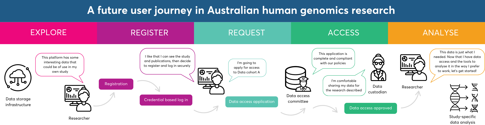
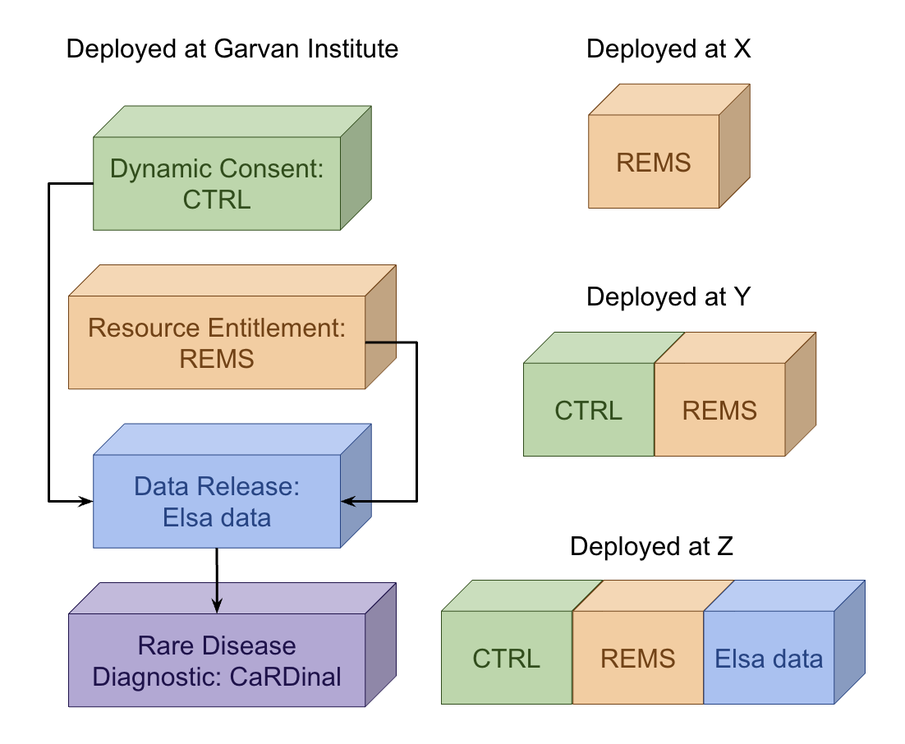

# Project3D-artefacts

This repository contains project artefacts such as user stories and diagrams for GUARDIANS Project 3D coordinated by the Garvan Institute of Medical Research.

## GUARDIANS

The GUARDIANS project (human Genomics Uplift for Australia through Research Data Infrastructure At National Scale) is a National initiative led by Australian BioCommons and funded by NCRIS through Bioplatforms Australia. It aim to empower Australian researchers to easily and securely discover, access, and analyze human genomics data across national infrastructure, using the latest tools and resources.

## Project 3D: Scalable, Open and Connected Genomics Infrastructure

Under this national grant, Garvan is leading a flashship project that is composed of a few different tools.

- Dynamic Consent Platform: CTRL
- Resource Entitlement Platform: REMS
- Data Release Platform: Elsa data
- Rare Disease Diagnostic Platform: CaRDinal

The goal of the flagship project is to deploy the different tools on Garvan infrastructure and build interaction between them. In the national context, the approach is modular and each institution can pick and mix the software that align with their needs.

