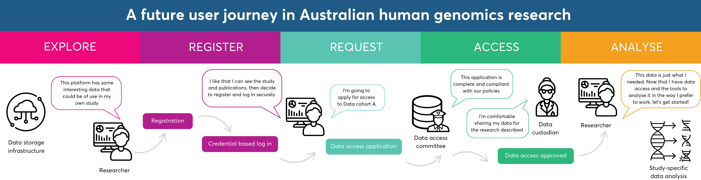
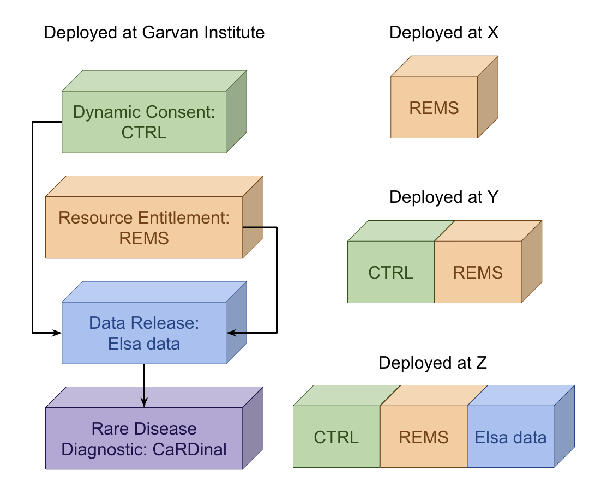

# Project3D-artefacts

This repository contains project artefacts such as user stories and diagrams for GUARDIANS Project 3D coordinated by the Garvan Institute of Medical Research.

## GUARDIANS

The GUARDIANS project (human Genomics Uplift for Australia through Research Data Infrastructure At National Scale) is a National initiative led by Australian BioCommons and funded by NCRIS through Bioplatforms Australia. It aim to empower Australian researchers to easily and securely discover, access, and analyze human genomics data across national infrastructure, using the latest tools and resources.

## Project 3D: Scalable, Open and Connected Genomics Infrastructure

Under this national grant, Garvan is leading a flashship project that is composed of a few different tools.

- Dynamic Consent Platform: CTRL
- Resource Entitlement Platform: REMS
- Data Release Platform: Elsa data
- Rare Disease Diagnostic Platform: CaRDinal

The goal of the flagship project is to deploy the different tools on Garvan infrastructure and build interaction between them. In the national context, the approach is modular and each institution can pick and mix the software that align with their needs.

## User Stories

### CTRL

- [CTRL Story 01: Assign DUO Codes to Survey Questions](/User_Stories/CTRL_User_Stories/CTRL01-duo_codes.md)
- [CTRL Story 02: Import Participant List from REDCap](/User_Stories/CTRL_User_Stories/CTRL02-redcap_participants.md)
- [CTRL Story 03: Multiple Studies](/User_Stories/CTRL_User_Stories/CTRL03-multi_study.md)
- [CTRL Story 04: API Endpoints for ELSA Integration](/User_Stories/CTRL_User_Stories/CTRL04-elsa_integration.md)
- [CTRL Story 05: CTRL / ELSA Integration Automated Configuration](/User_Stories/CTRL_User_Stories/CTRL05-ctrl_elsa_config.md)
- [CTRL Story 06: Study Admin Role](/User_Stories/CTRL_User_Stories/CTRL06-study_admin.md)
- [CTRL Story 07: AAI solution integration for CTRL admin (AAF member)](/User_Stories/CTRL_User_Stories/CTRL07-aai_integration_member.md)
- [CTRL Story 08: AAI solution integration for CTRL admin (non-AAF member)](/User_Stories/CTRL_User_Stories/CTRL07-aai_integration_non_member.md)

### Elsa

- [ELSA Story 01: ELSA / REMS integration automated configuration](/User_Stories/ELSA_User_Stories/ELSA01-rems_integration.md)
- [ELSA Story 02: AAI solution integration](/User_Stories/ELSA_User_Stories/ELSA02-aai_integration.md)
- [ELSA Story 03: NCI Data Exchange of Full Dataset](/User_Stories/ELSA_User_Stories/ELSA03-nci_data_exchange_full_dataset.md)
- [ELSA Story 04: NCI Data Exchange of Predefined Subset](/User_Stories/ELSA_User_Stories/ELSA04-nci_data_exchange_predefined_subset.md)
- [ELSA Story 05: NCI Data Exchange of Sample Level Custom Subset](/User_Stories/ELSA_User_Stories/ELSA05-nci_data_exchange_sample_subset.md)
- [ELSA Story 06: NCI Data Exchange of File Level Custom Subset](/User_Stories/ELSA_User_Stories/ELSA06-nci_data_exchange_file_subset.md)

### RDDP

- [RDDP Story 01: Cohort-level beacon on RDDP datasets](/User_Stories/RDDP_User_Stories/RDDP01-cohort_beacon.md)

### REMS

- [REMS Story 01: AAI solution integration](/User_Stories/REMS_User_Stories/REMS01-aai_integration.md)

## User Acceptance Test

### CTRL UAT

- [CTRL UAT 01: Researcher onboarding](/UAT/CTRL_UAT/CTRL_UAT_01-onboarding/)
- [CTRL UAT 02: AAF / AAI solution](/UAT/CTRL_UAT/CTRL_UAT_02-AAF/CTRL_UAT_02-summary.md)

### Elsa UAT

### RDDP UAT

- [RDDP UAT 01: Cohort-level beacon on RDDP datasets](/UAT/RDDP_UAT/RDDP_UAT_01-cohort_beacon/RDDP_UAT_01-summary.md)

### REMS UAT

- [REMS UAT 01: AAF / AAI solution](/UAT/REMS_UAT/REMS_UAT_01-AAF/REMS_UAT_01-summary.md)
- [REMS UAT 02: Audit Logs](/UAT/REMS_UAT/REMS_UAT_02-Audit/)
