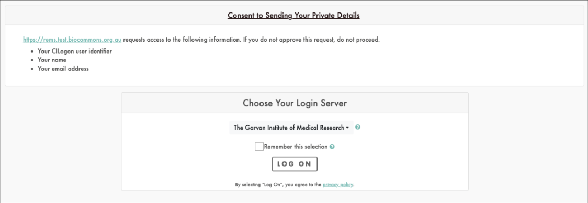
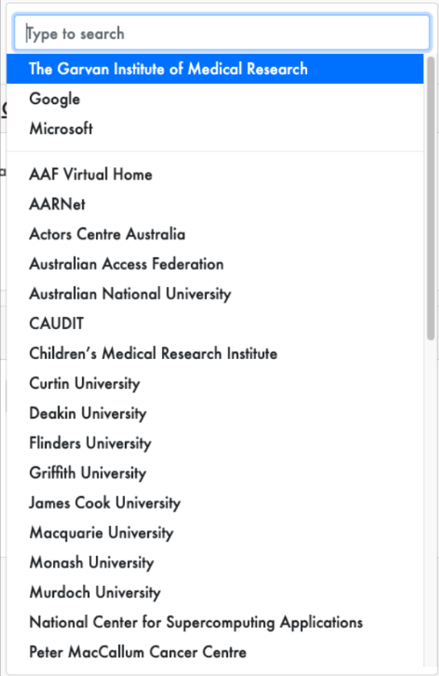

# REMS Epic 01: AAI solution integration

## Related GUARDIANS Task

3D-4-4: Defined core use-cases, requirements, acceptance criteria, and stub integration tests for integration with AAI solution (GUARDIANS project 2B), available on a platform like GitHub.

## User Story

- As a researcher from an AAF member organisation, I want to be able to login to REMS with my AAF credentials, so that I can apply for access to a dataset.
- As a researcher from an organisation that is not an AAF member, I want to be able to login to REMS with an existing Google or Microsoft account, so that I can apply for access to a dataset.
- As an admin, I want to be able to create the OIDC client, so that I can manage user authentication to REMS

## Context

AAF CILogon login page

Identity Provider List

## Acceptance Criteria

- [ ] Researcher from an AAF member organisation can log onto REMS via AAF AAI solution.
- [ ] Researcher from an organisation not AAF member can log onto REMS via AAF AAI.
- [ ] Admin can login to the AAF AAI admin portal and set up an OIDC client for REMS.
- [ ] Admin can login to the AAF AAI admin portal and manage users connecting to the service.
